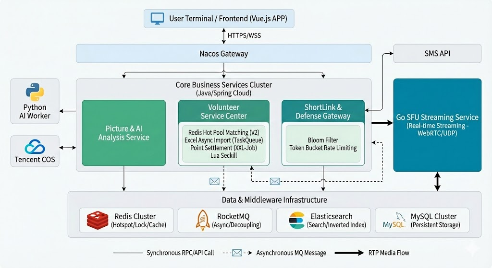

# ☀️ SoakUpTheSun - 视障人士全栈云辅助平台(持续开发中)

<div align="center">

[](https://spring.io/)
[](https://go.dev/)
[](https://vuejs.org/)
[](https://www.python.org/)

[](https://redis.io/)
[](https://rocketmq.apache.org/)
[](https://www.elastic.co/)
[](https://opensource.org/licenses/MIT)

</div>

<div align="center">
  <strong>
    <a href="README.md">English</a> | 
    <a href="README_CN.md">中文说明</a>
  </strong>
</div>

---

> **"Be their eyes, Online." / 云端借眼，温暖视界**

**SoakUpTheSun** 是一个基于 **Java + Go + Python** 的高并发异构微服务平台。我们摒弃了传统的线下救援模式，构建了一套基于 **Go SFU 实时流媒体** + **Redis 热池匹配** 的纯线上协助体系。

通过整合 **RocketMQ 异步解耦**、**Lua 原子锁** 与 **AI 视觉分析** 技术，我们让视障人士只需点击屏幕，即可跨越地域限制，毫秒级连接到全球志愿者。

**目前为一个学习类型的项目，您可以学习到，秒杀场景，大批量分发，缓存击穿，缓存穿透，即时通讯，匹配，AI模型的自部署使用等常见场景的解决方案。
每一个功能的具体实现图及其功能图由于篇幅问题，无法具体展现，您可以联系末尾的邮箱，我将把完整的架构图发送给您。**
## 🏗 系统全景架构 (System Topology)

本系统采用异构微服务架构，核心链路全异步化设计。



> **图解说明**：系统分为 Java 业务中台、Go 流媒体层与 Python AI 算力层。核心交互通过 Redis 热池进行调度，利用 RocketMQ 实现流量削峰。
> 
> ## 🚀 核心功能亮点

- **⚡️ 毫秒级在线热池匹配 (Hot Pool Matching)**
  利用 `Redis Set` 维护实时在线志愿者池。区别于传统数据库查询，我们仅匹配当前主动 `activate` 的用户，结合 Elasticsearch 兜底策略，确保接通率 > 99%。

- **🎥 自研 Go SFU 流媒体服务**
  基于 Pion 框架深度定制的 SFU 服务器，支持 WebRTC 信令交互与 RTP 包转发。针对弱网环境优化，端到端延迟控制在 200ms 以内。

- **🛡️ 高并发短链接防御体系**
  集成 **布隆过滤器 (Bloom Filter)** 与 **Redis 令牌桶**。在生成 6 位短码前进行 O(1) 极速判重，有效防止 ID 碰撞与恶意遍历攻击。

- **🔄 海量数据异步切片导入**
  采用 **TaskQueue + 异步线程池** 方案处理 10W+ 行级别的 Excel 导入。通过 Mybatis-Plus 批量插入与 ES 双写，避免长事务锁死数据库。

- **💰 Redis Lua 原子库存秒杀**
  在公益奖品兑换场景中，将“查询库存”与“扣减库存”封装为单一 Lua 脚本，在 Redis 单线程模型中原子执行，彻底杜绝超卖。

## 🛠 技术栈清单

| 领域 | 技术选型 | 核心作用 |
| :--- | :--- | :--- |
| **服务治理** | Spring Cloud Alibaba | Nacos (注册/配置), OpenFeign (RPC) |
| **音视频** | **Go (Golang) + Pion** | WebRTC 信令交换, RTP 媒体流转发 |
| **AI 计算** | Python + OpenCV | 计算机视觉分析 (OCR/物体识别) |
| **持久化** | MySQL 8.0 | 业务数据存储 |
| **缓存/锁** | Redis (Redisson) | 分布式锁, **热池(Set)**, **布隆过滤器**, Lua脚本 |
| **搜索** | Elasticsearch 7.x | 志愿者多维匹配 (Painless Script), 倒排索引 |
| **消息队列** | RocketMQ | 图片分析任务削峰, 异步解耦, Excel任务分发 |
| **任务调度** | XXL-Job | 分布式定时任务 (积分结算) |
| **对象存储** | Tencent COS | 图片/视频文件海量存储 |


## 🧩 核心设计难点与解决方案 (Design Challenges)

### 🔴 难点 1：高并发下的“超卖”与“撞单”
**场景描述**：在紧急呼救模式下，多个视障用户可能同时匹配到同一个在线志愿者；或在奖品秒杀时，库存被扣减为负数。
**解决方案**：
* **原子性保障**：放弃 Java层面的锁，将“查询状态”与“锁定状态”封装为 **Redis Lua 脚本**，利用 Redis 单线程特性实现原子执行。
* **分布式锁兜底**：在 Lua 执行成功后，引入 **Redisson 看门狗 (Watchdog)** 机制，防止业务逻辑执行超时导致的锁异常释放，确保数据强一致性。

### 🟡 难点 2：短链接系统的安全性与性能平衡
**场景描述**：视频房间链接仅 6 位字符，极易被黑客暴力遍历或发生 ID 碰撞。
**解决方案**：
* **极速验重**：引入 **布隆过滤器 (Bloom Filter)**，在生成短码前进行 O(1) 复杂度的内存级验重，阻断 99% 的无效数据库查询。
* **流量清洗**：配合 **Redis 令牌桶算法** 对请求 IP 进行限流，防止恶意扫描。

### 🔵 难点 3：海量积分数据的全量结算 OOM
**场景描述**：平台每日产生数百万条评价流水，全量加载至内存进行积分计算会导致 JVM 频繁 Full GC 甚至 OOM。
**解决方案**：
* **流式处理**：摒弃 `LIMIT offset`，设计基于主键 ID 的 **游标分页 (Cursor Pagination)** 机制，保证查询性能不随数据量增加而衰减。
* **内存聚合**：利用 Java 8 Stream API 在应用层进行小批次聚合计算，将 2000 次数据库 Update 合并为 1 次批量提交，大幅降低 I/O 开销。


## 📂 详细目录结构 (Detailed Structure)

```bash

SoakUpTheSun/
├── 📂 clientService/               # [前端] Vue.js 交互端
│   ├── public/                     # 静态资源 (Markdown CSS, Fonts)
│   ├── src/
│   │   ├── api/                    # Axios 接口封装 (user.js)
│   │   ├── assets/                 # 资源文件 (styles, images)
│   │   ├── libs/                   # 全局工具库 (Map, WebSocket插件)
│   │   ├── store/                  # Vuex 状态管理 (User, MessageDispatcher)
│   │   ├── utils/                  # 核心工具 (auth.js, request.js)
│   │   └── views/                  # 页面视图 (ChatRoom, JoinRoom, UserHome)
│   └── vue.config.js               # 前端代理与打包配置
│
├── 📂 sfu/                         # [流媒体] Go 自研 SFU 服务器 (WebRTC)
│   ├── internal/
│   │   ├── api/room/               # 房间管理 API (Join, Close, Save)
│   │   ├── cache/                  # Redis 缓存操作封装
│   │   ├── config/                 # 系统配置 (JWT, MySQL, Log)
│   │   ├── ws/                     # WebSocket 信令处理 (核心握手逻辑)
│   │   └── app/                    # 应用程序启动生命周期管理
│   ├── utils/                      # 工具包 (Base58, JWT, Encrypt)
│   ├── config.yaml                 # 流媒体端口与 ICE 配置
│   └── main.go                     # Go 程序入口
│
├── 📂 volunteer/                   # [后端] 志愿者核心业务模块 (最核心)
│   ├── src/main/java/org/hgc/suts/volunteer/
│   │   ├── common/
│   │   │   ├── manager/            # Redis 管理器
│   │   │   └── scheduledTask/      # XXL-Job 定时任务 (积分结算)
│   │   ├── controller/             # Web 接口层 (Facade模式)
│   │   ├── facade/                 # 门面模式封装复杂业务
│   │   ├── mq/                     # RocketMQ 消息驱动
│   │   │   ├── consumer/           # 消费者 (EasyExcel监听, 任务执行)
│   │   │   │   └── easyExcel/      # ⚡️ 异步切片导入 (ReadExcelDistributionListener)
│   │   │   ├── event/              # 领域事件对象
│   │   │   └── producer/           # 消息生产者
│   │   └── service/
│   │       ├── impl/               # 业务逻辑实现
│   │       │   ├── VolunteerMatchServiceImpl.java  # 🚀 混合双轨匹配策略
│   │       │   └── VolunteerPrizesServiceImpl.java # 奖品兑换逻辑
│   └── src/main/resources/
│       ├── lua/                    # ⚡️ Redis 原子脚本库
│       │   ├── redeem_volunteer_prizes_stock_synchronize.lua # 库存扣减
│       │   └── volunteer_active_match.lua                    # 热池匹配
│       └── scripts/
│           └── volunteer_match.painless  # 🔍 ES 动态权重打分脚本
│
├── 📂 picture/                     # [后端] 图片处理与 AI 对接服务
│   ├── src/main/java/org/hgc/suts/picture/
│   │   ├── common/tensentCos/      # 腾讯云 COS 对象存储封装
│   │   ├── mq/consumer/            # 监听图片上传/视频帧分析消息
│   │   └── ws/                     # AI 实时分析 WebSocket 通道
│
├── 📂 user/                        # [后端] 用户认证与鉴权中心
│   ├── src/main/java/org/hgc/suts/user/
│   │   ├── common/biz/user/        # UserContext 上下文与拦截器
│   │   └── remote/                 # OpenFeign 远程调用客户端
│
├── 📂 shortlink/                   # [后端] 短链接生成服务
│   └── src/main/java/org/hgc/suts/shortlink/
│       ├── config/                 # 🛡️ 布隆过滤器配置 (RBloomFilter)
│       └── service/impl/           # 短码生成与 302 跳转逻辑
│
├── 📂 docs/                        # 项目文档资源
└── pom.xml                         # Maven 父工程依赖管理
```
## 🚀 快速开始

### 环境要求
* JDK 17+ / Go 1.25+
* MySQL 8.0 / Redis 5.0+ / RocketMQ 5+
* Nacos 2.0+

### 部署步骤

**1. 基础设施启动**
```bash

docker-compose up -d mysql redis rocketmq nacos elasticsearch
cd clientService && npm install && npm run serve
---
```


## 🤝 贡献与联系

**SoakUpTheSun** 是一个技术驱动的公益项目。如果你对 **无障碍设计** 或 **高可用架构** 感兴趣，欢迎提交 PR。

* **Author:** XXieYiqiang
* **Email:** a1103938364@gmail.com

---
*如果你喜欢的话，希望你能给我一颗star*
